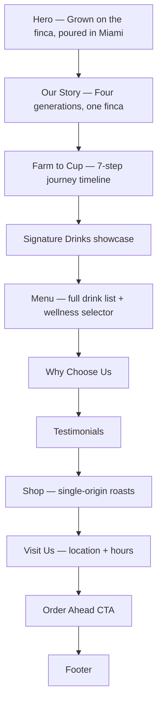

# ☕ Finca's Coffee

**A cinematic, editorial-style brand website for a four-generation family coffee farm — from a Honduran hillside to a Miami counter.**


---

## Overview

Finca's Coffee is a single-page marketing site built for a specialty coffee brand with a real story to tell: a family farm in Honduras, roasted and poured in Miami. Rather than a generic template, the site is built section-by-section as an editorial narrative — origin story, the farm-to-cup journey, signature drinks, a full interactive menu, and a shop — each with its own scroll-triggered motion, without ever feeling like a stack of disconnected widgets.

It's a **vanilla JavaScript + Vite** build on purpose: no framework runtime, no component library — just ES modules, native browser APIs (`IntersectionObserver`, CSS scroll-snap, CSS custom properties), and hand-tuned motion, kept fast and dependency-light.

**Live journey:** Login-free storytelling site → hero → farm story → farm-to-cup timeline → signature drinks → full menu with live preview → why-us → testimonials → shop → visit/order → footer.

---

## ✨ Features

| Feature | Description |
|---|---|
| 🎨 **Theme & accent switcher** | Dark/light mode plus four brand accent colors (Olive, Copper, Espresso, Terracotta), persisted in `localStorage` and reflected across the entire page via CSS custom properties |
| 🫘 **Farm-to-Cup timeline** | A seven-step scroll-driven journey (Farm → Harvest → Dry & Sort → Roast → Grind → Brew → Enjoy) with an animated progress rail |
| ☕ **Interactive menu gallery** | Hovering or focusing any of the 20+ drinks on the menu cross-fades a showcase image, tasting notes, roast, origin, and hot/iced indicator — no page reload, no framework state |
| 🌿 **Wellness drinks selector** | A tabbed showcase (Cinnamon Spice, Golden, Matcha, Butterfly Pea, Ginger Beet lattes) that swaps hero art, description, ingredients, and ambient glow color per selection |
| 🖱️ **Cursor-follow menu preview** | A floating thumbnail follows the pointer while browsing the menu list, previewing the hovered drink before you commit to it |
| 💬 **Testimonials carousel** | Native CSS scroll-snap on mobile with a synced dot indicator via `IntersectionObserver` — no JS-driven swipe logic needed |
| 🎬 **Scroll-driven motion system** | One shared engine (`scroll-effects.js`) powers reveal-on-scroll, parallax layers, a scroll progress bar, a nav that condenses on scroll, and magnetic CTA buttons — reused across every section |
| 📊 **Animated stat counters** | Story-section numbers (generations, founding year) count up into view |
| 🛍️ **Shop showcase** | Three single-origin roast cards (Honduras Dark, Buena Vista, Harvest Lot) with tasting notes and pricing |
| ♿ **Motion-safe by default** | Every animation respects `prefers-reduced-motion`, falling back to a static, fully-readable layout |
| 📱 **Fully responsive** | Fluid typography and spacing via `clamp()`, no fixed breakpoint layout drift from desktop to mobile |

---

## 🧭 Page Journey



---

## 🛠️ Tech Stack

| Layer | Technology |
|---|---|
| Build tool | [Vite](https://vitejs.dev/) 7 |
| Language | Vanilla JavaScript (ES modules) |
| Styling | Modular CSS with custom properties (design tokens) — no CSS framework |
| Typography | Cormorant Garamond (serif/display), Archivo (sans), Space Mono (labels/mono) — via Google Fonts |
| Motion | Native `IntersectionObserver`, CSS transitions/scroll-snap — no animation library |
| Persistence | `localStorage` for theme mode + accent preference |

No UI framework, no state management library, no CSS framework — every interactive piece is a small, single-purpose ES module wired up from `src/main.js`.

---

## 📁 Project Structure

```
finca-coffee/
├── index.html                  # Single-page markup — every section lives here
├── src/
│   ├── main.js                 # Entry point — wires up every feature module
│   ├── assets/
│   │   └── images/              # Hero, story, and shop product photography
│   ├── js/
│   │   ├── theme-switcher.js    # Dark/light mode + accent color, persisted
│   │   ├── story-stats.js       # Count-up stat animation for the Story section
│   │   ├── farm-timeline.js     # Farm-to-Cup scroll timeline + progress rail
│   │   ├── signature-drinks.js  # Signature Drinks card interactions
│   │   ├── menu-gallery.js      # Menu hover/focus → showcase cross-fade (+ MENU_INFO data)
│   │   ├── menu-float.js        # Cursor-follow drink preview thumbnail
│   │   ├── wellness.js          # Wellness drinks tabbed selector
│   │   ├── testimonials.js      # Mobile carousel dot-indicator sync
│   │   └── scroll-effects.js    # Shared reveal/parallax/nav/progress/magnetic-button engine
│   └── styles/
│       ├── main.css             # Imports every stylesheet below
│       ├── base.css             # Design tokens (color modes, accents) + resets
│       ├── switcher.css         # Theme/accent switcher panel
│       ├── story.css            # Our Story section
│       ├── farm-to-cup.css      # Farm-to-Cup timeline
│       ├── signature-drinks.css # Signature Drinks cards
│       ├── menu.css             # Menu list + showcase
│       ├── wellness.css         # Wellness drinks selector
│       ├── why-us.css           # Why Choose Us grid
│       ├── testimonials.css     # Testimonials carousel
│       └── shop.css             # Shop product cards
├── vite.config.js
└── package.json
```

---

## 🎨 Design System

- **Color modes** — dark and light, switched via a `data-fc-mode` attribute on `<html>`; every surface, text, and line color is a CSS custom property that resolves differently per mode.
- **Accent system** — four named accents (Olive/Matcha, Copper/Latte, Espresso/Coffee Beans, Terracotta/Signature Drink), switched via `data-fc-accent`, each with its own light- and dark-mode color pairing so contrast holds in both.
- **Typography** — `Cormorant Garamond` for display headlines and editorial italics, `Archivo` for UI text and buttons, `Space Mono` for eyebrow labels and numeric/meta text — a deliberate three-voice type system rather than one generic sans stack.
- **Motion restraint** — reveal, parallax, and magnetic-button effects are all opt-in via `data-reveal` / `data-parallax` / `data-magnetic` attributes on the markup, driven by one shared script, and fully disabled under `prefers-reduced-motion`.

---

## 🚀 Getting Started

```bash
# 1. Clone the repository
git clone https://github.com/ShibamPandab/Finca-Coffee.git
cd Finca-Coffee

# 2. Install dependencies
npm install

# 3. Start the dev server
npm run dev

# 4. Build for production
npm run build

# 5. Preview the production build
npm run preview
```

---

## 📜 Scripts

| Script | Purpose |
|---|---|
| `npm run dev` | Start the Vite dev server with hot module reload |
| `npm run build` | Produce an optimized production build in `dist/` |
| `npm run preview` | Serve the production build locally to sanity-check it |

---

## 🌱 Project Status

This is a **frontend brand/marketing site** — there is no backend, ordering system, or CMS wired up yet. "Order ahead" and "Add to bag" are presentational calls-to-action rather than functional checkout flows. It's built as a polished, production-quality front for a coffee brand's story, menu, and shop presentation.

---

## Author

**Shibam Pandab**

GitHub: [github.com/ShibamPandab](https://github.com/ShibamPandab)

---

## License

Licensed under the [MIT License](LICENSE).
